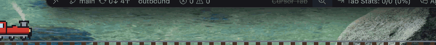

<p align="center">
  
</p>

<h1 align="center">Train of Thought</h1>

<p align="center">
  A tiny train chugs along the bottom of your screen while you stay in one app.<br>
  Every five minutes it gains a car. Switch apps or get a notification and it derails.
</p>

<p align="center">
  <a href="https://github.com/vsahasi/train-of-thought/actions/workflows/ci.yml"></a>
  
  
  
  
  
  <a href="LICENSE"></a>
</p>

<p align="center">
  
</p>

## Why

Timers nag. Blockers punish. Neither makes you *feel* the cost of a context switch.

Train of Thought puts the cost on screen. The longer you stay in one app, the longer your train gets. Glance down, see eleven cars, and the Slack ping can wait. Switch anyway and you watch them tumble. It never stops you from doing anything. It just makes sure you noticed.

It is [Forest](https://www.forestapp.cc) for your Mac's desktop, with a train instead of a tree, and without the guilt trip.

## Install

**Homebrew**

```sh
brew install --cask vsahasi/tap/train-of-thought
```

**Download**

Grab the zip from the [latest release](https://github.com/vsahasi/train-of-thought/releases/latest), unzip, drag to Applications. The app is not signed with an Apple Developer certificate, so the first time, right-click it and choose **Open**, or:

```sh
xattr -d com.apple.quarantine "/Applications/Train of Thought.app"
```

**Build it yourself**

```sh
git clone https://github.com/vsahasi/train-of-thought
cd train-of-thought
make install        # builds build/Train of Thought.app and copies it to /Applications
```

You need macOS 13 or later and either Xcode or just the Command Line Tools. There are no dependencies.

## The rules of the railway

1. **One app, one train.** A train belongs to the app that was frontmost when it left the station.
2. **A car couples every five minutes.** Adjustable from one to thirty. Every sixth car is gold.
3. **Switching apps derails the train**, after a five-second grace. Come back inside the grace and the train only wobbles. While you are away it brakes, so you can see the clock running.
4. **A notification banner derails the train.** Turn on a macOS Focus and only you can derail it.
5. **Some apps are passengers.** Spotlight, Raycast, Alfred, 1Password, Finder, system prompts and Train of Thought itself never derail anything. Add your own *crew* in Settings: apps that ride along, like a terminal next to your editor.
6. **Stepping away is not a derail.** Lock the screen, let the Mac sleep, or go idle for ten minutes and the train parks at the station. Come back to the same app and it departs with all its cars.
7. **A lone locomotive has nothing to lose.** Switch away before the first car couples and it simply drives off to the new app. Wrecks only happen when there is something to wreck.

## In the menu bar

The status item shows the current car count. The menu has your current run, your best run, today's totals, pause, and **Copy Train**, which puts this on the clipboard:

```
🚂🚃🚃🚃🚃🚃🚃🚃  7 cars · 35 min in Xcode
https://github.com/vsahasi/train-of-thought
```

Settings cover the timetable (minutes per car, grace, idle), derailments, crew, size (small, medium, large), whether the train fades back when nothing is happening, sounds, and launch at login.

## How it works

- **The train is Core Animation, not a render loop.** Wheels, bob, track and smoke are repeating `CAAnimation`s that run on the render server. The process idles at about 0.1% CPU and 25 MB.
- **Notification banners are detected without permissions.** Banners are ordinary windows owned by the NotificationCenter process. The app polls `CGWindowListCopyWindowInfo` twice a second and fires when a banner-sized window appears. Nothing in the banner is read. No Accessibility, no Full Disk Access, no reading the notification database.
- **The rules are a pure state machine.** `TrainCore` has no AppKit in it. Events go in with a timestamp, effects come out, and 36 tests pin the rules down. The app is a thin layer that turns effects into animations.
- **Sounds are synthesized** at first use, so there are no audio files in the repo. The whistle is two square waves with a bit of vibrato.
- **It builds with `swiftc` alone.** No Xcode project, no dependencies, under 2 MB on disk as a universal binary. `make` works on a Mac with only the Command Line Tools; `swift build` works with Xcode.
- **Nothing leaves your Mac.** There is no network code. Stats live in a JSON file in Application Support.

## Add your own car

Cars are ASCII art. This is the boxcar:

```
.KKKKKKKKKKKKKKKKKK.
KBBBBBBBBBBBBBBBBBBK
KBBBBBBKBBBBKBBBBBBK
KBBBBBBKBbbBKBBBBBBK
KbbbbbbKbbbbKbbbbbbK
KKKKKKKKKKKKKKKKKKKK
.KSSSSSSSSSSSSSSSSK.
..KDDK........KDDK..
..KDQK........KDQK..
...KK..........KK...
```

Draw one in `Sprites.swift`, add a case to `CarKind`, and run with a fast clock to watch it couple on. [CONTRIBUTING.md](CONTRIBUTING.md) has the details.

## Development

```sh
make            # build the .app
make run        # build and launch
make test       # TrainCore tests (XCTest with Xcode, a small stand-in without)
make probe      # watch the notification-banner sensor
make hero       # regenerate the README animation from the sprites
TRAIN_CAR_SECONDS=3 "build/Train of Thought.app/Contents/MacOS/TrainOfThought"   # fast clock
```

The design document, including the decisions behind each rule and what was deliberately left out, is in [docs/superpowers/specs/](docs/superpowers/specs/2026-10-06-train-of-thought-design.md).

## FAQ

**Does it block anything?** No. It is a mirror, not a wall.

**It derailed when I opened my password manager.** 1Password and Bitwarden are passengers already. If yours is not, add it as crew in Settings, and open an issue so it can be added for everyone.

**Can it track browser tabs?** No. One app, one train. Switching from the docs to Twitter inside the same browser is between you and your conscience.

**Several monitors?** The train runs on the screen with the menu bar.

**Why is it not signed?** There is no Apple Developer account behind this project yet. The release workflow builds the exact code in this repo on GitHub's runners, and the zip's SHA-256 is published next to it.

**It got distracting.** Settings has a smaller size, a fade-when-quiet toggle (on by default), and *Show the train on screen*, which keeps counting with the overlay hidden.

## License

MIT.
